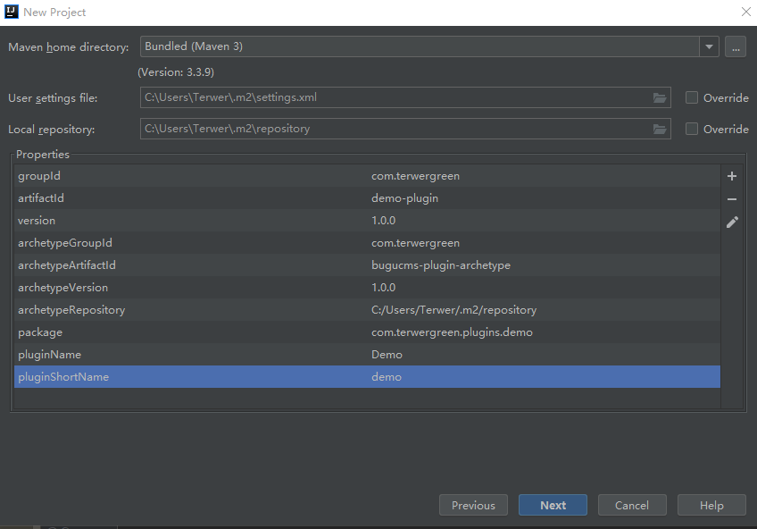

# bugucms-plugin-archetype

#### 项目介绍
BuguCMS 插件模板


#### 安装教程

```
mvn clean install -Darchetype.test.skip
```

#### 使用说明

> 打开 ``IntelliJ IDEA``             
> 选择菜单 ``File`` -> ``New`` -> ``Project`` -> ``Maven``             
> 勾选 ``Create from Darchetype``            
> 点击 ``Add Darchetype``，输入以下内容                  

```
GroupId:com.terwergreen         
ArtifactId:bugucms-plugin-archetype                   
Version:1.0.2             
```

> 选择刚刚添加的archetype，点击 ``next``，输入新项目的信息                 

```
GroupId:com.terwergreen                      
ArtifactId:demo-plugin                                 
Version:1.0.2           
```

> 点击 ``Next`` ，输入其他参数            

```
package=com.terwergreen.plugins.demo
pluginName=Demo
pluginShortName=demo
```

完整的参数如下：



> 点击 ``Next`` ，输入项目名及项目路径            

```
demo-plugin      
C:\Users\Terwer\IdeaProjects\bugucms-plugins\demo-plugin
```

> 点击 ``Finish``， 完成，等待2分钟左右，一个插件项目就大功告成了。                 

#### 联系作者

[http://www.terwergreen.com](http://www.terwergreen.com/guestbook.html)